# Matchmaker as Code: A Constraint-Based Approach to Cross-Platform Multiplayer

*GDC 2026 Session by Albert Puértolas (Gameloft Barcelona)*

## 講演者紹介

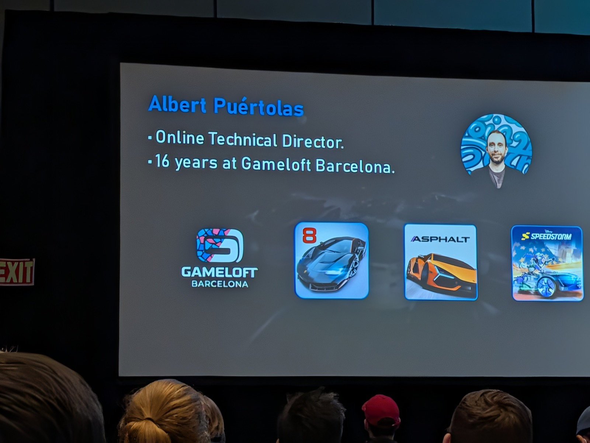

Albert Puértolas氏は、Gameloft Barcelonaのオンラインテクニカルディレクターとして16年間の経験を持つベテラン開発者です。Asphalt 8、Asphalt 9、Disney Speedstormなど、数々のヒットレーシングゲームの開発に携わってきました。

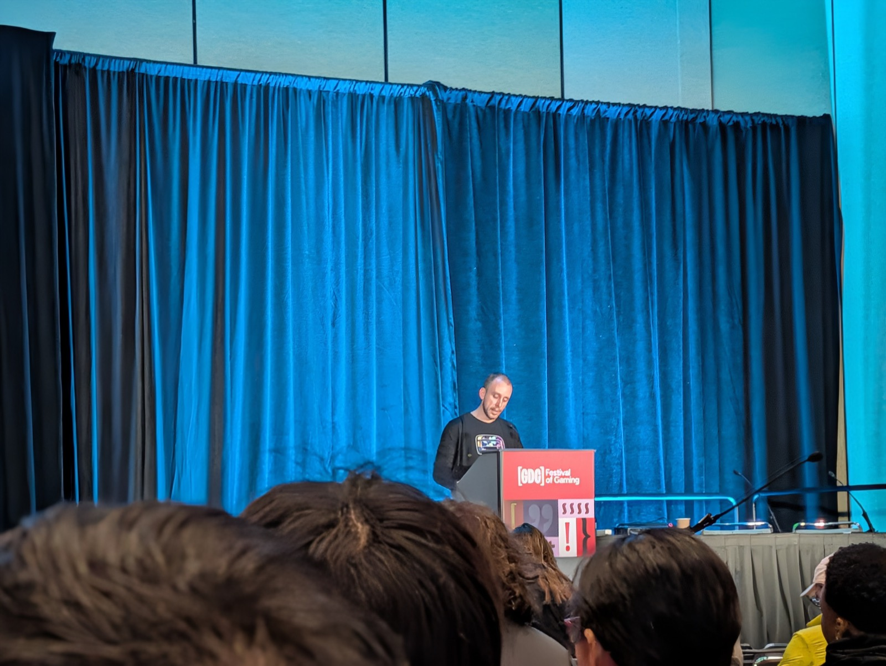

## マッチメイキングの課題：トレードオフのジレンマ

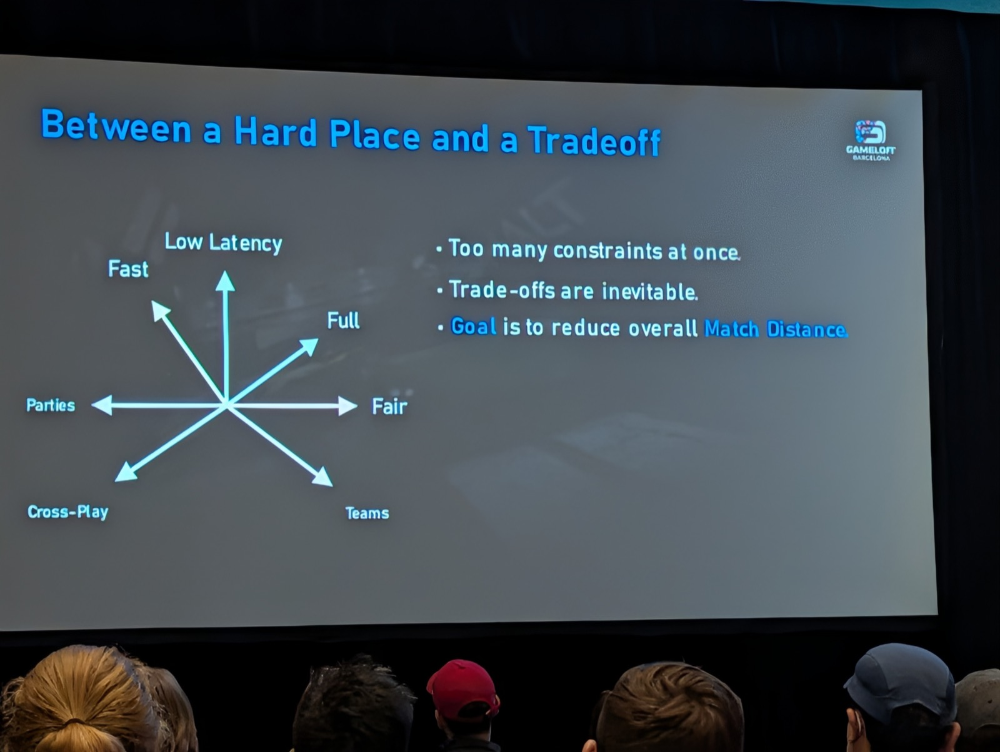

現代のマルチプレイヤーゲームにおけるマッチメイキングは、複数の相反する要求のバランスを取る必要があります：

- **Fast（速度）**: プレイヤーを素早くマッチさせる
- **Low Latency（低遅延）**: 良好なプレイ体験の確保  
- **Full（満員）**: ロビーを適切な人数で埋める
- **Fair（公平）**: スキルレベルの均衡
- **Parties（パーティー）**: フレンド同士で一緒にプレイ
- **Teams（チーム）**: バランスの取れたチーム編成
- **Cross-Play（クロスプレイ）**: 異なるプラットフォーム間でのマッチング

これらの制約を同時に満たすことは困難で、必然的にトレードオフが発生します。目標は全体的な「マッチ距離」を最小化することです。

## 制約の種類

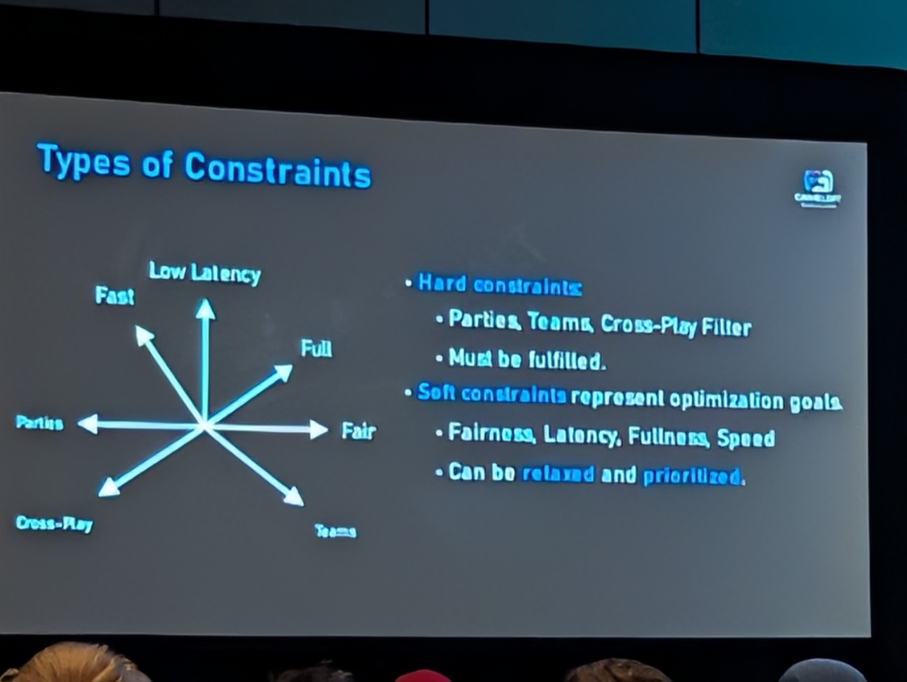

制約は大きく2種類に分類されます：

### ハード制約
- **必ず満たす必要がある制約**
- パーティー、チーム、クロスプレイフィルターなど

### ソフト制約  
- **最適化目標を表す制約**
- 公平性、遅延、満員度、速度など
- リラックス（緩和）や優先順位付けが可能

## マッチとチケット

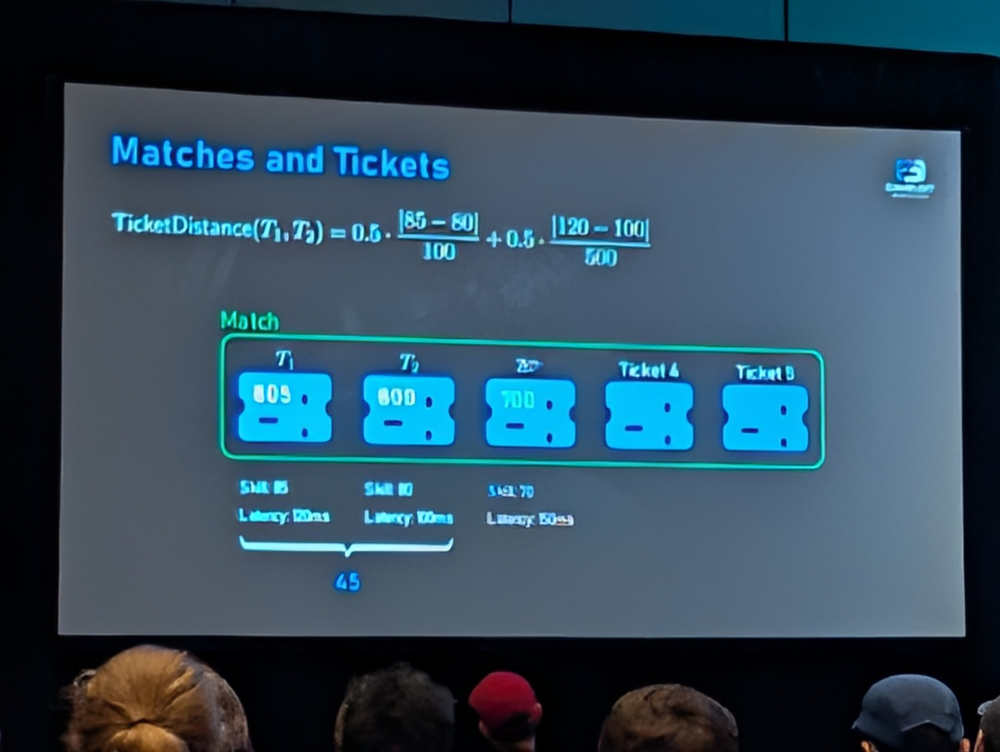

マッチメイキングシステムの中核となる概念：

- **チケット**: プレイヤーまたはプレイヤーグループのマッチングリクエスト
- **マッチ**: 複数のチケットをまとめたゲームセッション

チケット間の「距離」は、スキルレベルと遅延の違いを考慮した数式で計算されます。この例では、スキル差と遅延差を正規化して合計しています。

## レイテンシーの最適化

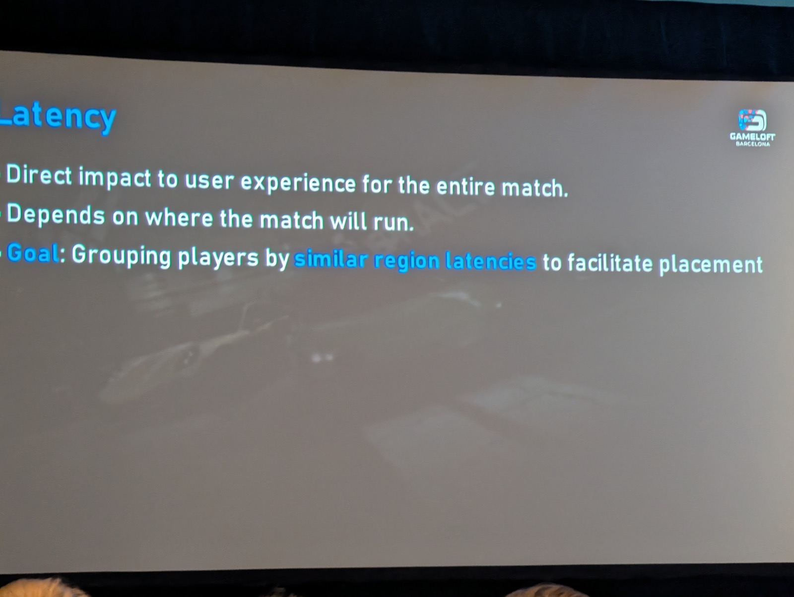

レイテンシーは試合全体のユーザー体験に直接影響を与える重要な要素です：

- **マッチがどこで実行されるかに依存**
- **目標**: 類似した地域レイテンシーを持つプレイヤーをグループ化し、サーバー配置を容易にする

## 許容範囲の緩和

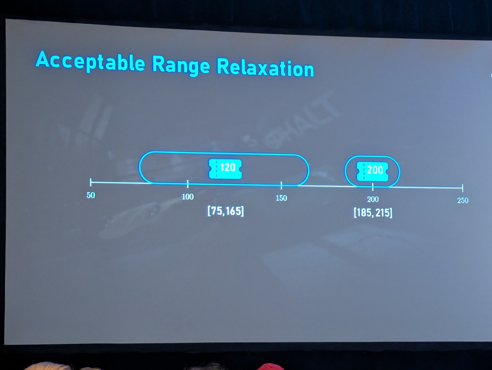

時間経過とともに制約を緩和することで、マッチング成功率を向上させます：

- スキルレベル120のプレイヤーの場合
- 初期範囲: [75, 165]
- 緩和後範囲: [185, 215]

この動的な調整により、待ち時間とマッチ品質のバランスを取ります。

## 非推移的制約の処理

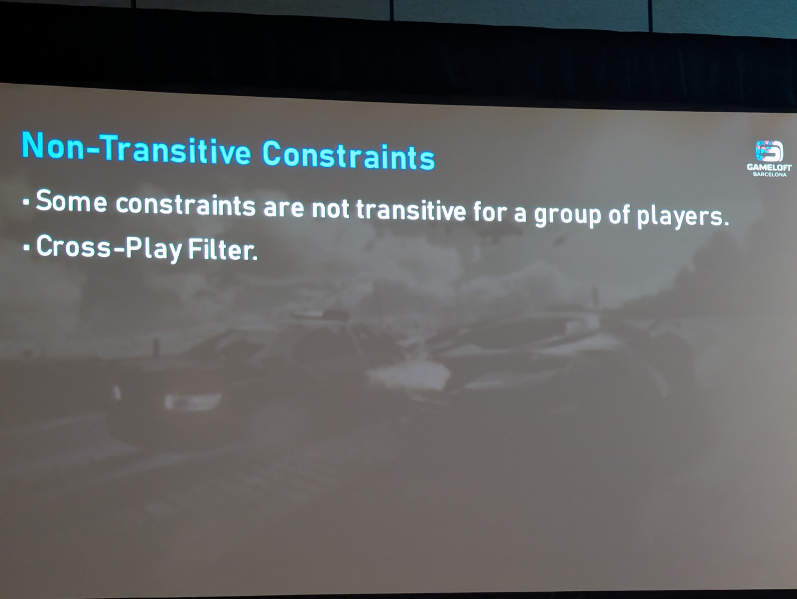

いくつかの制約は、プレイヤーグループに対して推移的ではありません。特にクロスプレイフィルターがその代表例です。

例：
- プレイヤーA（クロスプレイON）はプレイヤーB（クロスプレイOFF）とマッチ可能
- プレイヤーB（クロスプレイOFF）はプレイヤーC（異なるプラットフォーム）とマッチ不可
- しかし、全員を同じマッチに入れることはできない

## グローバルな推論

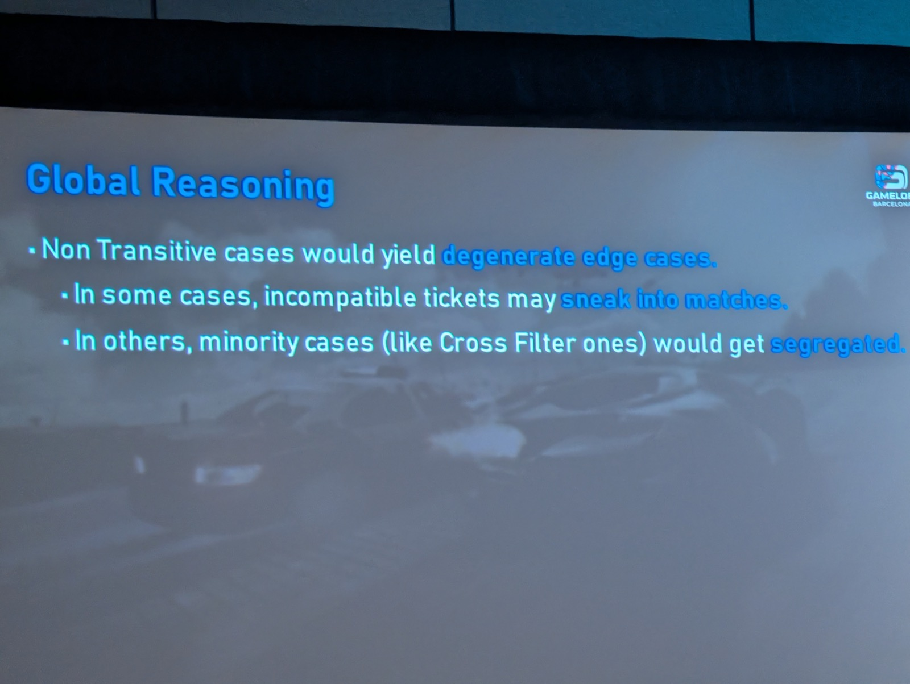

非推移的なケースは「縮退エッジケース」を生み出します：

- **互換性のないチケットがマッチに潜り込む可能性**
- **マイノリティケース（クロスフィルターなど）が分離される可能性**

これらの問題を解決するには、局所的な最適化だけでなく、グローバルな視点での推論が必要です。

## 実装：すべてを統合する

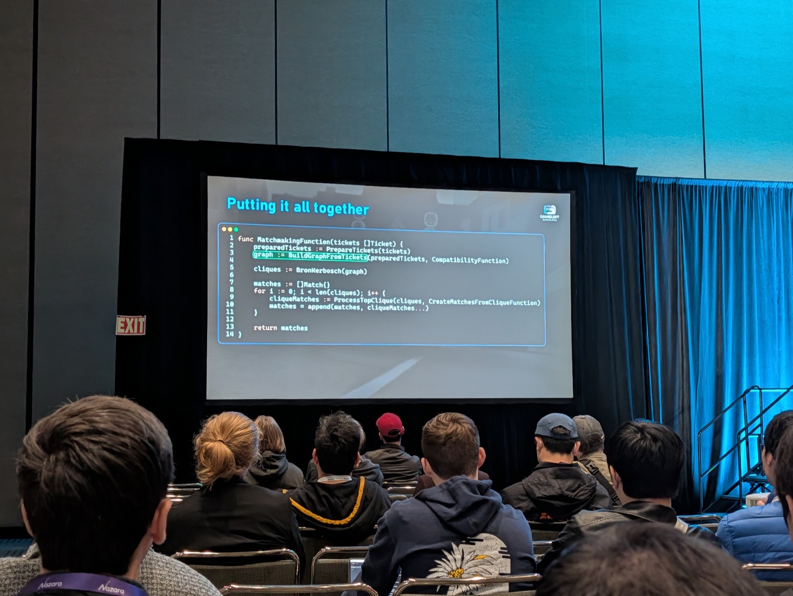

実際のコード実装例：

```cpp
func MatchmakingFunction(tickets []Ticket) {
    preparedTickets := PrepareTickets(tickets)
    graph := BuildGraphFromTickets(preparedTickets, CompatibilityFunction)
    
    cliques := BronKerbosch(graph)
    
    matches := []Match{}
    for i := 0; i < len(cliques); i++ {
        cliqueMatches := ProcessTopClique(cliques, CreateMatchesFromCliqueFunction)
        matches = append(matches, cliqueMatches...)
    }
    
    return matches
}
```

主要なステップ：
1. チケットの準備（前処理）
2. 互換性グラフの構築
3. Bron-Kerboschアルゴリズムによるクリーク検出
4. 各クリークからマッチの生成

## クリークの処理

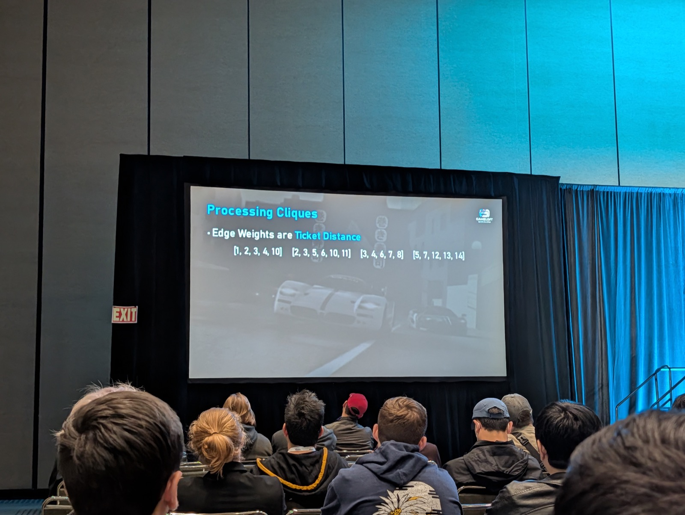

エッジの重みはチケット間の距離を表します：

- クリーク例: [1, 2, 3, 4, 10], [2, 3, 5, 6, 10, 11], [3, 4, 6, 7, 8], [5, 7, 12, 13, 14]
- 各クリークは潜在的なマッチの候補
- 最適なマッチングを見つけるために、クリークを分析・分割

## パーティーの処理

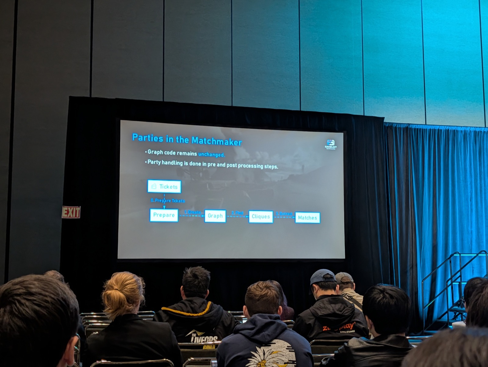

パーティー処理の流れ：

1. **グラフコードは変更なし**
2. **パーティー処理は前処理と後処理のステップで実施**

処理フロー：
```
Tickets → Prepare → Create Graphs → Cliques → Matches
         ↑                                        ↓
    b.PrepareTickets                         c.PostProcess
```

この設計により、パーティー制約を効率的に処理しながら、メインのグラフアルゴリズムをシンプルに保つことができます。

## モニタリングとアナリティクス：Elastic Stack

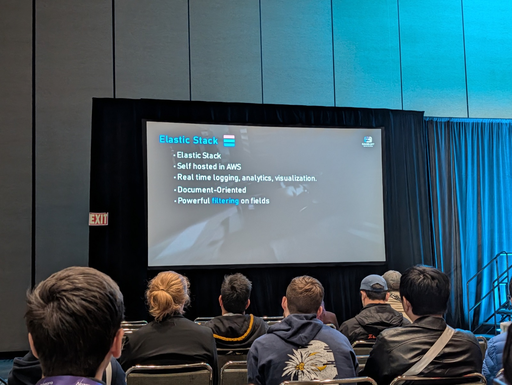

本番環境でのマッチメイキングシステムの監視には、Elastic Stackを活用：

- **AWSでセルフホスティング**
- **リアルタイムログ記録、分析、可視化**
- **ドキュメント指向データベース**
- **フィールドに対する強力なフィルタリング機能**

これにより、マッチング品質の継続的な監視と改善が可能になります。

## まとめ

「Matchmaker as Code」アプローチは、複雑なマッチメイキング問題を体系的に解決するフレームワークを提供します：

1. **制約ベースの設計**: ハード制約とソフト制約を明確に分離
2. **グラフ理論の活用**: Bron-Kerboschアルゴリズムによる最適なグループ検出
3. **動的な緩和**: 時間経過とともに制約を調整し、マッチング成功率を向上
4. **グローバルな推論**: 局所最適ではなく全体最適を追求
5. **実装の柔軟性**: パーティーなどの特殊ケースを前処理・後処理で対応

このアプローチにより、クロスプラットフォームマルチプレイヤーゲームにおいて、公平で楽しく、レスポンシブなマッチメイキング体験を提供できます。

---

*Session URL: [https://schedule.gdconf.com/session/implementing-a-built-in-multiplayer-ugc-experience-in-genshin-impact/917102](https://schedule.gdconf.com/session/implementing-a-built-in-multiplayer-ugc-experience-in-genshin-impact/917102)*